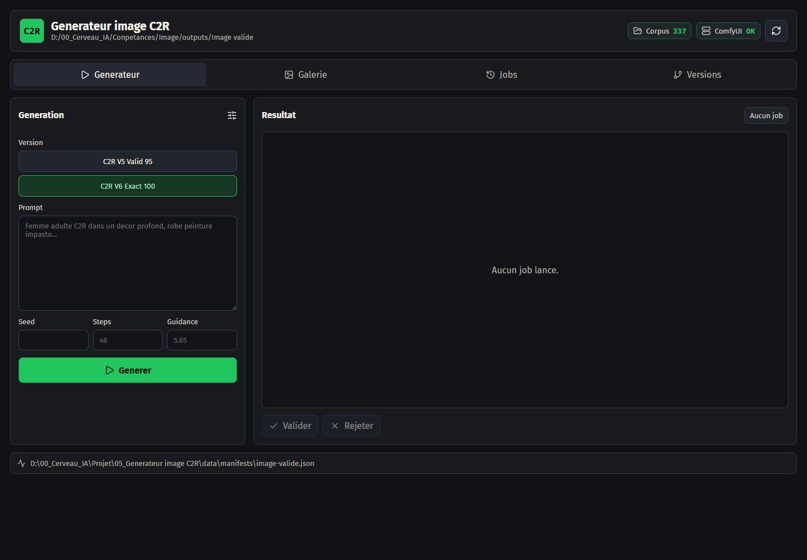
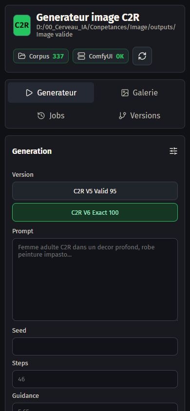

# Generateur image C2R

## Concept

Studio local de generation d'images C2R. Il expose une interface web, lit le corpus Image valide, lance les generations et organise les retours utiles.

Creer rapidement des images coherentes avec les projets et transformer les essais visuels en assets reutilisables.

## Fonctionnalites principales

- Centralise une interface de generation d'images.
- Lit le corpus Image valide via manifeste.
- Lance des jobs de generation et suit leurs resultats.
- Aide a valider ou rejeter les images produites.

## Installation locale

```powershell
npm install
```

## Lancement

```powershell
npm run dev
npm run start
npm run build
```

## Captures d'ecran





## Variables d'environnement

Copier `.env.example` vers `.env` en local puis remplir les valeurs privees.

## Securite

Ne jamais publier `.env`, tokens, sessions, logs sensibles, cles privees ou donnees personnelles.
